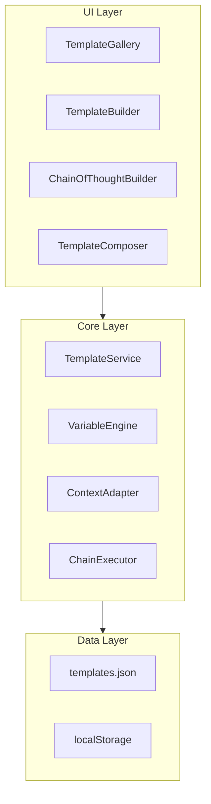

# Smart Template System - Implementation Plan

## Goal
Build an industry-leading template system with variable injection, contextual adaptation, chain-of-thought construction, and composable template sections.

---

## System Architecture



---

## Proposed Changes

### Data Models

#### [NEW] `src/core/templates/template.types.ts`
```typescript
// LangChain-style variable syntax: {variable}
interface PromptTemplate {
  id: string;
  name: string;
  description: string;
  category: TemplateCategory;
  template: string;
  variables: VariableDefinition[];
  sections?: TemplateSection[];      // For composition
  chainSteps?: ChainStep[];          // For CoT
  contextOptions?: ContextOptions;
  tags: string[];
}

interface VariableDefinition {
  name: string;
  label: string;
  type: 'text' | 'textarea' | 'select' | 'number';
  defaultValue?: string;
  suggestions?: string[];            // Auto-suggest
  required: boolean;
}

interface ContextOptions {
  targetModels: ('gpt-4' | 'claude' | 'gemini' | 'llama')[];
  outputFormats: ('text' | 'markdown' | 'json' | 'code')[];
  tokenOptimization: boolean;
}

interface ChainStep {
  id: string;
  order: number;
  prompt: string;
  outputVariable: string;            // Feeds into next step
}

interface TemplateSection {
  id: string;
  name: string;
  content: string;
  isOptional: boolean;
}
```

---

### Core Services

#### [NEW] `src/core/templates/variable.engine.ts`
- `extractVariables(template)` - Parse `{var}` from string
- `renderTemplate(template, values)` - Replace variables
- `getSuggestions(varName)` - Return history-based suggestions
- `trackUsage(varName, value)` - Save to localStorage for auto-suggest

#### [NEW] `src/core/templates/context.adapter.ts`
- `adaptForModel(prompt, model)` - Tweak prompt for specific AI
- `optimizeTokens(prompt)` - Compress while preserving meaning
- `formatOutput(prompt, format)` - Add format instructions

#### [NEW] `src/core/templates/chain.executor.ts`
- `buildChain(steps)` - Validate step connections
- `executeStep(step, context)` - Run single step
- `executeChain(steps, initialVars)` - Run full chain

---

### New Components

| Component | Purpose |
|-----------|---------|
| `TemplateGallery` | Browse/search/filter templates |
| `TemplateCard` | Single template display |
| `VariableForm` | Dynamic form for variables |
| `ContextPanel` | Model/format/optimization toggles |
| `ChainBuilder` | Visual node editor for steps |
| `TemplateComposer` | Drag-and-drop section mixer |
| `PreviewModal` | Live preview before apply |

---

### New Dependencies

```json
{
  "@dnd-kit/core": "^6.0.0",      // Drag-and-drop for composer
  "@dnd-kit/sortable": "^7.0.0",  // Sortable lists
  "reactflow": "^11.0.0"          // Node-based CoT builder
}
```

---

### 25 Curated Templates

| Category | Templates |
|----------|-----------|
| **Coding** | Code Review, Bug Fix, Refactor, Explain Code, Write Tests |
| **Writing** | Blog Outline, Email Draft, Summarize, Rewrite Tone, Proofread |
| **Marketing** | Ad Copy, Landing Page, Social Post, SEO Meta, Product Desc |
| **Productivity** | Meeting Notes, Task Breakdown, Decision Matrix, SWOT, Email Reply |
| **Creative** | Story Prompt, Character Builder, Dialogue, World Building, Plot Twist |

---

## User Flows

### Flow 1: Use Template
1. Browse gallery → Select template → Fill variables → Preview → Apply

### Flow 2: Chain of Thought
1. Open CoT Builder → Add steps → Connect outputs → Execute chain

### Flow 3: Compose Template
1. Open Composer → Drag sections → Reorder → Save combination

---

## 8-Phase Implementation

| Phase | Feature | Status |
|-------|---------|--------|
| 1 | Core Infrastructure (types, services) | ⬜ |
| 2 | Template Library UI (gallery, cards) | ⬜ |
| 3 | Variable Injection (parsing, forms) | ⬜ |
| 4 | Contextual Adaptation (model selector) | ⬜ |
| 5 | Favorites & Custom Templates | ⬜ |
| 6 | Template Preview | ⬜ |
| 7 | Chain of Thought Builder | ⬜ |
| 8 | Template Composition | ⬜ |

---

## Verification Plan

### Automated Tests
- Variable extraction/rendering
- Context adaptation for each model
- Chain execution with variable passing

### Manual Testing
- Create 5-step chain, verify output flows
- Compose template from 3 sections
- Token optimization comparison
